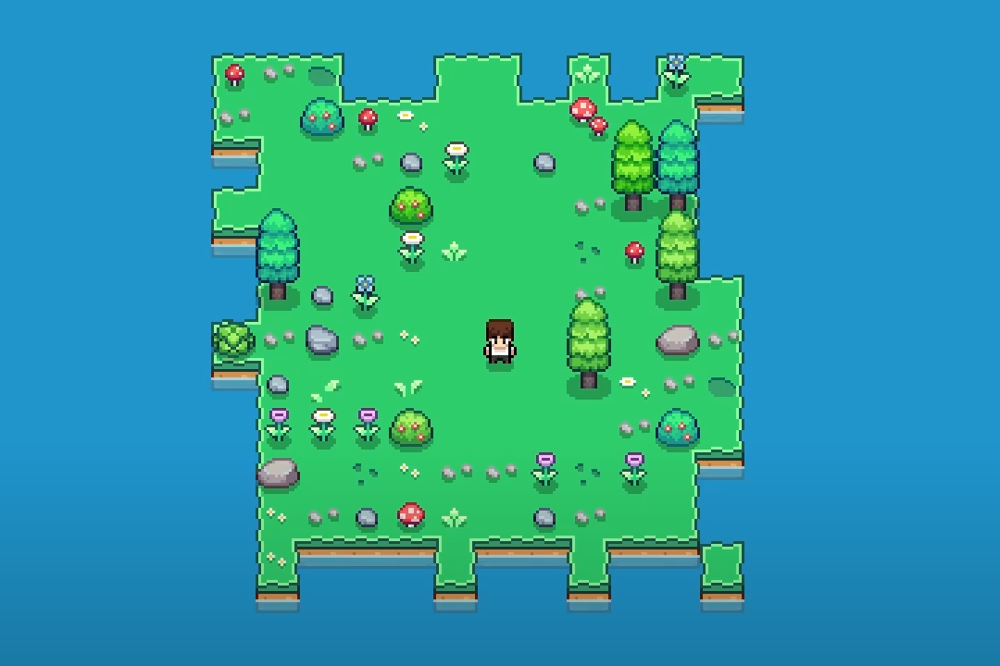

# Island 2D Procedural Generation

A 2D island made in Unity Engine and procedurally generated based on predefined sizes and a provided seed.

### Implementation

A multidimensional grid of tiles is generated based on pseudo-random numbers to determine the depth of the terrain, then a choice is made whether it is water or land.

Then each tile is checked to know the composition of its neighboring tiles and determine which sprite will be used.

### Videos

Small Procedurally Generated Island in Unity - https://www.youtube.com/watch?v=eBia1TZmAtM
Small Procedurally Generated Island in Unity (Short) - https://www.youtube.com/shorts/w1NsYWN5sNU

### References

Blob tileset - https://opengameart.org/content/wang-%E2%80%98blob%E2%80%99-tileset
Bitwise Tilemapping - https://blog.kylekukshtel.com/bitwise-tilemapping-unity